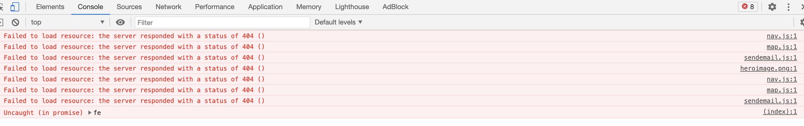

- [**Quizijuana**](#--quizijuana--)
  * [**Demo**](#--demo--)
  * [**User Experience**](#--user-experience--)
  * [**Strategy Plane**](#--strategy-plane--)
    + [Creator Goals](#creator-goals)
    + [User Stories](#user-stories)
  * [**Scope Plane**](#--scope-plane--)
  * [**Structure Plane**](#--structure-plane--)
    + [**Skeleton**](#--skeleton--)
  * [**Surface**](#--surface--)
    + [Design](#design)
    + [Typography](#typography)
    + [Colour Scheme](#colour-scheme)
  * [**Features**](#--features--)
    + [Home page](#home-page)
    + [Contact Section](#contact-section)
    + [Quiz game](#quiz-game)
    + [Features to be implemented in the future](#features-to-be-implemented-in-the-future)
  * [**Technologies**](#--technologies--)
  * [**Testing**](#--testing--)
    + [Code Validation](#code-validation)
      - [HTML](#html)
      - [CSS](#css)
      - [JavaScript](#javascript)
    + [Testing User Stories](#testing-user-stories)
    + [Link Testing](#link-testing)
    + [Navigation Testing](#navigation-testing)
    + [Quiz Game](#quiz-game)
    + [Contact Form](#contact-form)
    + [Lighthouse](#lighthouse)
      - [Accessibility](#accessibility)
      - [Performance](#performance)
      - [Best Practices](#best-practices)
      - [SEO](#seo)
    + [Device and Brower Responsiveness Testing](#device-and-brower-responsiveness-testing)
    + [Other issues](#other-issues)
  * [**Deployment**](#--deployment--)
    + [Run locally](#run-locally)
  * [**Credits**](#--credits--)
    + [Media](#media)
    + [Code](#code)
    + [Acknowledgements](#acknowledgements)

# **Quizijuana**
---

Second Milestone Project- Interactive Frontend Development - Code Institute

Welcome to my project, the Quizijuana app.

Quizijuana is my second assignment for the Full Stack Development course at Code Institute. The requirements for this project were to develop a front-end web application using HTML, CSS and JavaScript. In addition, the implementation of front-end interactivity, using core JavaScript, JavaScript libraries and/or APIs were also necessary. Testing is crucial through development, implementation and deployment stages for the app.

I aim to build a fun and interactive quiz app related to Marijuana to allow users to learn and test their knowledge on this magical hemp plant. My inspiration for this project comes from the many controversial news surrounding marijuana, and its huge increase in legalisation and its use for medical and recreational purposes globally. The questions in this quiz will cover a wide range of topics related to Marijuana, including questions about history, potency, political status and more. This quiz can not only be used for entertaining purposes, but also for educational and activist purposes.

## **Demo** 
---

A live demo can be found [here](https://tindyc.github.io/quizijuana/).


## **User Experience**
---

In this section, I am going to provide insights into my UX process, mainly focusing on who this web application is built for, what they intent to achieve and how they can best utilise this web application to fulfil their needs.

According to Caglar Araz from UX Collective, User Experience (UX) is "User experience refers to the singular and accumulated experiences that occur for users as a consequence of them interacting with an object in a given context."

The planning and development of this project is divided into 5 planes:

1. The Strategy Plane
2. The Scope Plane
3. The Structure Plane
4. The Skeleton Plane
5. The Surface Plane

## **Strategy Plane**
---

### Creator Goals
* to create an interactive web application that is fully responsive on desktop to smaller devices such as mobile.

* to create a website with interface design, presenting a logical structure allowing users to easily navigate.

* to understand and write JavaScript effectively to produce interactive and relevant responses according to user's action on the website.

* to build a site with a quiz game that users will find entertaining and enriching.

* to educate and allow users to test their knowledge on the controversial plant of Marijuana.

### User Stories
* As a first-time user, I would like the purpose of the website to be clear and straight forward.

* As a first-time user, I would like to be able to navigate to desired sections on the site without having to search and scroll.

* As a first-time user, I would like the quiz to be visually appealing with logical characteristics (Score, Progress Bar and Visual response for correct/incorrect answers).

* As a first-time user, I would like to easily find instructions for the quiz should I need it.

* As a first-time user, I would like to be able to easily contact site owner when necessary (i.e. leave feedbacks or suggestions).

## **Scope Plane**
---

* A simple home page with responsive navigation bar to allow user to easily navigate without having to scroll and to show the purpose of the website.

* Instructions provided in the home page so users can easily access before they start playing the quiz game.

* A simple quiz design that is visually appealing, non-distracting and easy to use.

* Score and progress bar features in game to allow users to track their performances.

* An end page to allow users to save their score, compare results on leaderboard and to easily navigate back to home page or restart the game.

* A contact section for users to easily contact and connect with the site owner using a contact form with contact details also provided on the page (contact info and google map) and social links on footer.

* The design of the website should be visually consistent across all aspects to make it visually pleasing and comfortable for users.

* The web application should be responsive across different resolutions.

## **Structure Plane**
---

1. Home
    * Navbar is always fixed on top of the page with "Quizijuana" logo on the left-hand side of the bar and a menu on the right with clear names of site pages for the ease of navigation. The colour will change to green (#45A29E) when the users hovers over them to reinforce the links are clickable. This Navbar will stay consistent throughout the entire website and will automatically minimised into a hamburger menu on smaller devices.

    * The content of the home page contains a brief introduction to the purpose of this web application. Clear instructions of the quiz are also included for the users to follow and a button to be directed straight to the quiz game. 

    * A footer with social media links is featured at the bottom to allow users to easily connect with site owner. The green colour (#45A29E) of the hover effect on the icons is consistent with the rest of the site.

2. Quiz 
    * The Start game page contains buttons to easily navigate to the “Quiz”, “Highscores” and back to “Home” page.

    * The Quiz game contains score, progress bar and number of questions to allow users to track their performance and see how many questions remaining.

    * Questions are shuffled and fetched from questions.json file with the help of JavaScript so that users will have a new experience each time they play the game.

    * There are 4 multiple-choices answers for each question for the user to select from.

    * Correct answer will turn Green, whilst incorrect answer will turn Red.

    * The game will end when all 10 questions have been answered. User will be directed to the End page where they will be able to save their score on the leaderboard, go home or restart the game by clicking on relevant buttons.

    * The Navbar and footer have both been removed as I would like to create an in-game mode. It is unnecessary for the users to navigate elsewhere in the middle of the quiz. Once the quiz is completed, users will be automatically directed to the End game page where there will be relevant buttons for ease of navigation back to Home, Highscore or restart the quiz.

3. Contact
    * The content of the contact section consists of contact details, a contact form and a visually attractive google map.
        - The contact details (phone number, email and address) will be accompanied with icons with hover effects to gives the website more depth and a hands-on feel. The change in colour to green (#45A29E) is consistent throughout the site.
        - The simple contact form will allow the user to contact the site owner by filling out the required fields for Full Name, Email, Message and then clicking the Submit button. When the form has been successfully submitted, an alert will pop up to indicate the form has been submitted.
        - The interactive google map displays the location of the address with a custom marker to match the theme and info window when clicked to provide further. information.
  
### **Skeleton**

Wireframe

[Home Wireframe](assets/wireframes/homewireframe.pdf)

[Quiz Wireframe](assets/wireframes/quizwireframe.pdf)

[Contact Wireframe](assets/wireframes/contactwireframe.pdf)

## **Surface**
---

### Design

My desire is to design a web application that is clean and crisp with minimal distractions so that the user can concentrate on choosing the correct answers for the quiz. All the fonts and styles are consistent throughout the site to make the users feel comfortable. With the help of Bootstrap, CSS styles and media queries, the site is responsive across devices from desktop, laptop, tablet to mobile. Even on smaller devices, the contents are aligned proportionally and styled to make sure they are still legible and well-displayed. Altogether, the design and layout of the site should be entertaining and captivating so that a user is able to understand and enjoy the site.

### Typography
The fonts I have chosen for the site is Nova Square with sans-serif as a fall back. It is a modern and stylish looking font style that is pleasant to look at, simple to read and understand. Nova Square font has a robotic feel and it is bold and engaging which matches the functionality of the quiz app.


The website is fully responsive across all devices with the help of CSS styling and media queries along with Bootstrap to custom font sizes (smaller for mobile devices) and styles to keep all the content in place and legible.

### Colour Scheme

The background colour is simply black (#000) and font colour is white (#FFF) in all pages for consistency. A lighter shade of white ( rgb(226, 226, 226)) is used for the fonts on the Navbar so that it is easier on the eyes and to slightly blend into the black background since it is a fixed-top Navbar. The black and white combination is clean and work well together to ensure users are not distracted from the quiz itself. The white fonts contrasting on black background ensure all the content would be easily seen and legible. The colour for the hover effects used is green (#45A29E). This is done to reinforce the links are clickable and to give an animated effect for the icons used in the footer and contact page. Green was chosen as it is the colour of the plant itself to match the theme of the quiz. In the quiz app pages, green (#45A29E) is used again for the buttons with a lighter shade of green (rgb(134, 230, 225)) for the hover effects for the "Play", "Play again", "Save" and "Go Home" buttons. The "Highscores" button is yellow (rgb(255, 247, 9)) with a lighter shade of yellow ( rgba(255,255,0,0.5)) for the hover effect. I decided to use a different colour for the “Highscore” button to make it more stand out to encourage users to check out the leaderboard page for their saved scores. The fonts colour for the buttons are black (#000), contrasting the background colour, so that it is clearly visible.


## **Features**
---

This project is neat and straight forward. It is logically designed whilst also keeping design consistency in all aspects of the page. The navigation bar allows easy navigation with faster, more efficient access to the desired content. It stays fixed on top of the page. It is responsive across different resolutions and collapses according to screen size at `768px` width or smaller to encourage a user-friendly and minimalist design. Hover effect is used in all links and icons to add a bit of animation to the site to make it more appealing and to reinforce the links are clickable. The links will open a new tab so that the user does not leave the site. The use of bootstrap and CSS have allowed the site to be responsive across various devices. 

### Home page
* Large quintessential Hero image, with heading text laid on top, is in the header of the home page to draw the attention of the users and to encourage users to play.  It is styled to be almost like a landing page with content if you scroll down.  
* The content of this page consists of a brief introduction to the quiz, instructions and a direct link to the quiz itself via the "Play" button or Navbar. The Narbar provides direct links to all section of the site. The footer contains social links to allow users to connect with site owner.

### Contact Section
* Simple contact form, with fields for Full Name, Email, Message and Submit button, implemented for users to fill should they wish to contact the site owner.
    - All the fields in the contact form are required and must be field correctly, otherwise the form will not be submitted. The users will be alerted of the errors. The email field requires to be filled correctly in the right format with "@" or "." included.
    - When the form is submitted successfully by filling out all the fields and then clicking the Submit button, an alert will pop up with a message to indicate the form has been sent. An email will be sent to the site owner with data from the contact form.
* Interactive Google map with custom marker (cannabis icon to match the theme of the site) and info window will pop up when clicked to provide further information about the site.

### Quiz game
* Score and Progress bar features included in the quiz so users can track their performance and see how many questions remaining.
* Questions are shuffled when the game restarts to give users a new experience each time they play.
* Chosen answers will respond with relevant colours changes to reflect the response. Font colour changes to yellow when hovered over the answer. When the answer is selected, correct answer will turn green and incorrect answer will turn red.
* Users will be directed to the endgame page when no more questions remaining.
* Highscore feature included to allow users to save their scores on the end page. Data including Name and Score will be saved in browser local storage, and the top 5 scores are displayed on the Leaderboard at the Highscore page.

### Features to be implemented in the future

* Generate questions from an external API to expand the question bank.
* Difficulty levels introduced into the quiz to make it more exciting for the users and to suit their preference.
* Timer feature to let user know their time taken to complete the quiz
* Sound effects to reflect the responses from the user's action in the game.
* Introduce animation to the quiz to make it more dynamic.

## **Technologies**
---

* [HTML5](https://www.w3schools.com/html/) - language used to build the basic structure of the project.

* [CSS](https://www.w3schools.com/css/) - language used to style the HTML elements.

* [Javascript](https://www.javascript.com/) - main language used to add interactive behaviours to the site that engage users and for DOM manipulation.

* [Bootstrap v5.0](https://getbootstrap.com/docs/5.0/getting-started/introduction/) - main framework used to make the website responsive and to structure content.

* [Font Awesome](https://fontawesome.com/)- provided icons to create social links.

* [EmailJS](https://www.emailjs.com/) - API used to enable contact form submission and allow site owner to receive email with information from contact form from users.

* [Google Fonts](https://fonts.google.com/)- Nova and Square is the main font used and linked from Google Fonts.

* [Google Map JavaScript API](https://developers.google.com/maps/documentation/javascript/overview)- API used to fetch and create interactive google map.

* [Git](https://git-scm.com/) - version control software used to commit and push code to GitHub.

* [Gitpod](https://gitpod.io/) - workspace for development the project.

* [GitHub](https://github.com/) - hosting site for storing code for the project with Github Pages used to deploy the live site.

* [Google Chrome DevTools](https://developers.google.com/web/tools/chrome-devtools) - used for inspecting elements in finding issues and bugs and testing responsiveness of the project.

* [Am I Responsive](http://ami.responsivedesign.is/)- site used to create multi-device image to illustrate responsiveness

* [Balsamiq](https://balsamiq.com/)-  creative tool to produce wireframes for the project

## **Testing**
---

### Code Validation

#### HTML
* All HTML code was tested and validated with W3C Markup Checker.

* Two warnings were shown suggesting that I should considering using ```h2-h6``` elements. However, I do not wish to add headings to those sections in the Home page. To bypass this warning, I changed `section` to `div`.


#### CSS
* All CSS code was tested and validated with W3C CSS Validation Service.

* No errors or warnings reported.

#### JavaScript
* All JavaScript code was checked using JSHint. It has identified all the unused variables in my codes and helped me add in any missing semicolons.

### Testing User Stories 

* As a first-time user, I would like the purpose of the website to be clear and straight forward.
    - Home page with hero image with heading question and introduction of the quiz.
    

* As a first-time user, I would like to be able to navigate to desired sections on the site without having to search and scroll.
    - Home page have a responsive navigation bar to allow easy access across the site. The Quiz game has buttons to be directed to various sections of the site.
    

* As a first-time user, I would like the quiz to be visually appealing with logical characteristics (Score, Progress Bar and Visual response for correct/incorrect answer).
    - Score and Progress Bar located on top of the quiz to allow users to track their performance and see how many questions remaining until they complete the quiz.
      

    - Relevant colours changes to elements to reflect the response for user’s interaction. Font colour changes to yellow when hovered over the answer. When the answer is selected, correct answer will turn green and incorrect answer will turn red.
    
* As a first-time user, I would like to easily find instruction for the quiz should I need it.
    - Home page with instructions section to guide users how to play the quiz.
    
* As a first-time user, I would like to be able to easily contact site owner when necessary (i.e. leave feedbacks or suggestions).
    - Contact section includes contact info and a simple contact form to send a message to the site owner directly.
        - Users can contact me by filling out all the required fields in the contact form. 
        The "required" attribute is applied to the "Full Name", "Email" and "Message" fields, hence, the form will not submit if the "required" fields are not filled in. 
        The "Email" field will only accept email addresses. Therefore, when an invalid address is submitted, there will be an error message indicating the invalid data and the form will not submit.
        If all the "required" fields are filled in with valid attributes, it will send an email to the site owner and an alert will pop up.
        
    -Footer contains social media links to allow users to connect with the site owner with ease. 
        

### Link Testing
* All the external links in the page will open in a new tab implementing 'target="_blank"' and have been manually tested to confirm that they will direct to the correct destination. 
* All the internal site links will navigate to the right path and have been manually tested to confirm they will direct user to expected page.
* By clicking on the "Submit" button in the contact form, if all the fields are filled correctly and in the right format, an email will be sent to the site owner and an alert will pop up to indicate the form is sent.

### Navigation Testing
* The navigation bar has been manually tested by Google Chrome DevTools and testing physically on devices including iPhone XS Max, 12 and LG G8, to ensure the ease of navigation on both full and hamburger-style menus across devices. 
* During manual testing, I noticed the hero-image and google map overlaid on top of the Navbar on both full and hamburger-style menus in the home page. This was resolved by adding style property value `z-index:999` in CSS.

* The collapsed Navbar displays correctly on mobile and smaller devices and looks much cleaner than having a full Navbar that takes up the top of the page.


### Quiz Game
The quiz game was manually tested to ensure all aspects are functional as I am a complete beginner to JavaScript and I am still learning. However, during the process of development, I used the `console.log()` method to test console outputs and checked for errors on Google Chrome DevTools console. Due to my lack of experience in JavaScript, there was a lot of trials and errors involved and this method was useful in checking the codes to ensure functionality during development. The use of online tutorials helped me further understand the logic of JavaScript and how to utilise various functions effectively in building my desired app. As my programming knowledge deepens, I hope to start doing some unit testing in JavaScript.

* The progress bar will update accordingly as the user go through each question.
* The score will update accordingly as the user go through each question.
* The font colour of the answers will turn yellow when hovered over.
* The correct answer will turn red when selected.
* The incorrect answer will turn green when selected.
* When an answer is clicked, it automatically goes to the next question.
* The "Play again" button functions properly, the page will reload and reset the quiz game.
* The questions are shuffled each time the game restarts.
* The quiz will end automatically when all 10 questions have been answered. Users will be directly to the end page automatically where they will have the option to save their scores.
* The score is saved into local storage and top 5 scores are displayed onto leaderboard.

### Contact Form
* The contact form has been manually tested to ensure it functions properly.
* This was done by submitting the form without filling in one of the three fields each time to ensure the `required` fields features works correctly. An alert displaying "Please fill out this field." will appear when there are missing fields in the form on submission.

* The Email input value was manually tested to see if it automatically validates the email to ensure email is property formatted. Missing values such as "@" or “.” and having them in the incorrect place will not pass the validation. This was done by inputting an invalid email to see if an alert will show. 

* Finally, all the fields were filled in accurately and submit button was clicked. If all the required fields are filled in correctly, the form will be submitted and an alert displaying "Thank you for contacting us. We'll respond within 24hours!" will pop up. 

* Once the form has been submitted, the email that I had connected with EmailJS received the submitted contact form details. This means that the contact form was linked to EmailJS correctly.


### Lighthouse
I used Lighthouse on Google Chrome DevTools to identify and fix common problems that affected my site's performance, accessibility, and user experience.


* On the Google Chrome DevTools console, I got a "404 Favicon error". This was resolved by adding a transparent favicon.ico to the head tag in the HTML.

#### Accessibility
* I manually checked and added `alt` attribute if there were any missing to improve accessibility.
* I manually checked that all the social media icons at the footer contained a description for screen-reader users.
* There is an error for Heading elements not being in a sequentially-descending order for the `h5` elements in the footer. I have decided to ignore this as I intentionally wanted the font size at the footer to remain small.

#### Performance 
* There was an error for the image elements not having explicit width and height. This was referring to the two icons used in the home page. I resolved this by changing the `height` property of the icons from `auto` to `112px` as this was the auto height specified on Google DevTools.
* There were other opportunities suggested under performance by lighthouse. Due to time constraint and my lack of experience in programming now, I have decided to work on this at a later stage.

#### Best Practices
* There is a warning regarding font-end JavaScript libraries with known security vulnerabilities under Trust and Safety.  Due to time constraint, I have decided to work on this at a later stage. This could be solved by stop using each of the libraries that Lighthouse flags and replacing it with a different library or newer version.
* During the last stage of development, whilst I was checking the codes, I realised the scripts for the Bootstrap buddle were out of date and I had upgraded it to the new Bootstrap5 bundle. This error has now been fixed and the score for best practices is now 100.

#### SEO 
* The SEO score for my site is 100.

### Device and Brower Responsiveness Testing
* This website has been manually tested across various browsers including Chrome, Internet Explorer, Safari and FireFox to ensure functionality and responsivity. All is working well with no errors.
* I used Google Chrome DevTools to test responsiveness and compatibility across devices. This was done for the following devices:
    - Moto G4
    - Galaxy S5
    - Pixel 2
    - Pixel 2 XL
    - iPhone 5/SEO
    - iPhone 6/7/8
    - iPhone 6/7/8 Plus
    - iPhone X
    - iPad
    - iPad Pro
    - Surface Duo
    
* During the testing phrase, I noticed some of the texts are too big on smaller devices. To solve this issue, `font-size` property values were added in a media query in CSS.
* I also identified that the hover effect does not work properly on the answers in the quiz on mobile. The hover stays active on mobile devices.  This is because there is no persistent cursor on mobile browsers. Many devices use touch screen, which reacts only to touch; hence there is no hover.
* Just to be extra sure, I further tested the responsiveness of the site through [Google's Mobile-Friendly Test](https://search.google.com/test/mobile-friendly) and received a "page is mobile friendly" result.

### Other issues
* On deployment onto GitHub pages, all the JavaScript stopped working on the deployed site and the links on the Navbar could not direct to the expected page and showed a 404 error. This was caused by the build-up of GitHub pages. I resolved this by replacing all absolute links to relative links in the HTML. 
* The hero-image also faced a file path issue. This was fixed by changing the path using `../` to come out of the CSS folder and then move into the images folder.


* The above file path issues have inspired me to create a custom 404.html on GitHub page site so user can click on the "Go Home" button to be directed back to the home page should they encounter errors.


## **Deployment**
---
This project is hosted using GitHub pages, deployed directly from the master branch.
The deployed site automatically updates simultaneously to new commits to the master branch.

To deploy this site to [GitHub Pages](https://pages.github.com/), the following steps were followed:
    - Log into GitHub.
    - From the list of repositories on the screen, select **Tindyc/quizijuana**.
    - Navigate to the **Settings** tab underneath the repository name.
    - Scroll down to the **GitHub** Pages section.
    - Under Source click the drop-down menu labelled **None** and select **Master Branch**.
    - Click **Save** and the page will refresh automatically.
    - Scroll back down to the **GitHub Pages** section to retrieve the link to the deployed website.

### Run locally
To clone this project into Gitpod, follow these steps:
    - Log into GitHub.
    - From the list of repositories on the screen, select **Tindyc/quizijuana**.
    - Above the list of files, select **Code** on the drop-down menu.
    - Copy the clone URL under the **HTTPS** tab.
    - Start a terminal window in your preferred IDE.
    - Change the directory to the whichever location you would like the cloned directory to be located.
    -Type ```git``` clone, and paste the link you copied in step 3.
    - Press enter and your local clone has now been created.

## **Credits**
---
### Media 
* Images: [Unsplash](https://unsplash.com/), a stock image library.
    - [Hero-image](https://images.unsplash.com/photo-1470299568568-d4e15c4b6472?ixid=MXwxMjA3fDB8MHxwaG90by1wYWdlfHx8fGVufDB8fHw%3D&ixlib=rb-1.2.1&auto=format&fit=crop&w=1953&q=80)
    - [Background image for Contact info section](https://images.unsplash.com/photo-1611084621059-a4c28ba05098?ixid=MXwxMjA3fDB8MHxwaG90by1wYWdlfHx8fGVufDB8fHw%3D&ixlib=rb-1.2.1&auto=format&fit=crop&w=1950&q=80).

* Cannabis icons: [Flaticon](https://www.flaticon.com/), a free vector icons database.
    - [About icon](https://www.flaticon.com/free-icon/research_3520597?term=weed&page=2&position=48&page=2&position=48&related_id=3520597&origin=tag)
    - [Brain icon](https://www.flaticon.com/svg/vstatic/svg/3997/3997018.svg?token=exp=1614023367~hmac=200be8b9e81b55e80871f53e0822379c)
    
* Google Map: [Google Map JavaScript API](https://developers.google.com/maps/documentation/javascript/overview)

### Code
* Code for responsive collapsed hamburger-menu Navbar adapted from [kotchimel](https://www.codeply.com/p/hVa3gv9Umw).
* Code from JavaScript Tutorial for building quiz app adapted from [James Q Quick](https://www.youtube.com/watch?v=u98ROZjBWy8&list=PLDlWc9AfQBfZIkdVaOQXi1tizJeNJipEx&index=1&ab_channel=JamesQQuick/).
* [Google JavaScript API](https://developers.google.com/maps/documentation/javascript/overview) for documentations to setting up custom map using JavaScript API.
* [Email JS](https://www.emailjs.com/) for documentations to linking contact form to email.
* [GitHub Docs](https://docs.github.com/en/github/working-with-github-pages/creating-a-custom-404-page-for-your-github-pages-site) for creating a custom 404 page on GitHub page site.

### Acknowledgements

First of all, I would like to thank Guido Cecilio, my mentor from Code Institute, for guiding me through from designing to the deployment of my second project.

Many thanks to the Slack community for offering solutions to the various bugs I encountered during the development of this site.

Finally, a huge thank you to my friends and family who attempted the quiz on their own devices and offered not only user experience feedbacks but also love and emotional support.


